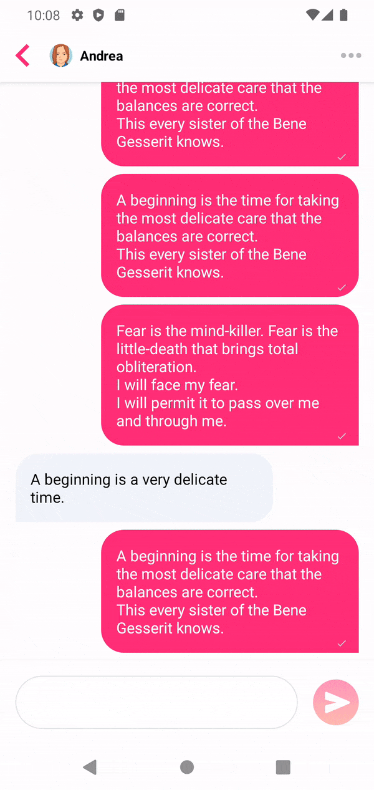

# ChatDemo

ChatDemo is a simple Jetpack Compose UI chat sample.

This sample showcases:
* UI state management
* [Android Architecture](https://developer.android.com/jetpack/guide)
* Room database
* Back button handling
* Text Input and focus management
* Basic Material Design theming
* UI tests
* Unit tests

## Features

### Jetpack Compose UI
Application UI has been written in Jetpack Compose UI. 
The new declarative UI framework is already stable, 
and I would recommend any new app to adopt it. 
However, a lot of components that existed in Views still need to be created, 
so some extra work was required. On the other hand, 
I have not noticed anything that could not be done in Compose UI, 
so I believe it is ready for production. 

### Architecture
Architecture follows the standard blueprint proposed in
[Guide to app architecture](https://developer.android.com/jetpack/guide). 

<b>MainActivity</b> is a single activity in the application 
as the only application entry point. Even with more screens, 
it is recommended to keep using single activity 
as screens can be represented as composable functions now. 

For easy navigation between such screens, 
I would recommend using 
the [Navigation Compose library](https://developer.android.com/jetpack/compose/navigation). 
Since there is no navigation in the current implementation, 
usage of such a solution was not necessary. 

<b>ConversationUI</b> file 
and composable function represent currently the only screen in the application. 
It is divided into multiple functions for clarity 
and even one function was extracted to <b>MessageUI</b> file 
to separate big building blocks. 

<b>ConversationViewModel</b> provides UI with data 
and handles actions from UI. It uses <b>AddMessageUseCase</b> and <b>MessageStore</b>. 
StateFlow is used as a state-holder observable flow that is collected in UI. 

<b>AddMessageUseCase</b> uses <b>MessageStore</b> to save new messages in the database. 
It runs a coroutine with an IO dispatcher to avoid running database operations on the main thread.

<b>MessageStore</b> is a datastore that works with the Room database. 
<b>Message</b> data class is an entity that represents <b>messages</b> table in our database. 
The database currently doesn’t handle migration to the new version,
but that can wait until there is a new version. 
Also, to showcase features in the UI, I pre-populate the database with some preview data.

All dependencies are provided by <b>ChatServiceLocator</b>. 
For such a small app it perfectly serves its purpose. 
Going forward I would recommend using [Hilt (DI library)](https://developer.android.com/training/dependency-injection/hilt-android).

I create <b>MessageList</b> object to move code 
that works with relations between messages to domain object 
that can be easily tested in unit tests.

### Tests
There are two files with unit tests: 
<b>ConversationViewModelTest</b> and <b>MessageListTest</b>. 

<b>MessageListTest</b> is straightforward and holds unit tests for <b>MessageList</b>.
 
<b>ConversationViewModelTest</b> tests adding 
and reading of messages from the ViewModel interface. 
It uses real objects and only uses fake for the Room database (<b>MessagesDao</b>). 
This allows us to test most of the business logic from a single interface, 
but as more logic is added to tested objects, we might need to write more isolated tests.
 
There is also one UI instrumentation test run with dummy ComponentActivity provided by the test library. 
This allows us to test the UI in isolation.

## TODOs

UI would definitely need more work. 
With proper design, themes, styles, typography, etc.
The dark mode is not handled properly and the screen is forced to be white. 
 
Once more screens are written, more and more components, styles and colours can be reused 
and extracted from the current UI.

The status of a message (sent, delivered and read) can be implemented 
(though, without backend, it would be only faked again).
 
Since there is no backend, there is only a single conversation 
and no authentication or proper profile handling, this is a very simple app. 
Once backend synchronization is added, 
multiple conversations allowed, etc. more design decisions would have to be made. 
But I would let the design evolve with requirements :)
